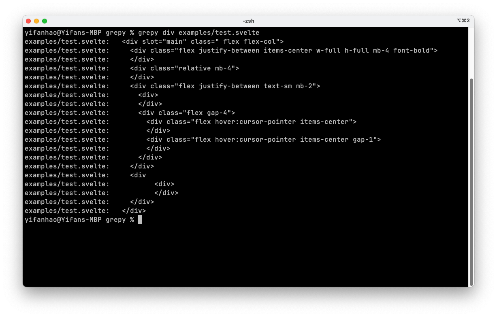

# Grepy

A simple remake of the unix command-line utility `grep` in C++

Utilizes the [Boyer-Moore string-search algorithm](https://en.wikipedia.org/wiki/Boyer%E2%80%93Moore_string-search_algorithm) to efficiently search for the pattern string.

Currently only supports direct search in a file, but more features to be added soon!

## Build

To build and install Grepy, follow these steps:

1. Clone this repo:

```bash
git clone ...
```

2. Navigate to project directory

```bash
cd grepy
```

3. Build

```bash
make
```

4. Optionally, you can install Grepy system-wide:

```bash
sudo make install
```

## Usage

Once built/installed, you can use Grepy as follows:

```bash
./grepy PATTERN FILE
```

OR

```bash
grepy PATTERN FILE
```

Replace `PATTERN` with the string you want to search for. Specify the `FILE` where you want to perform the search.

## Examples

1. Search for a specific word in a file:

```bash
grepy hello file.txt
```


